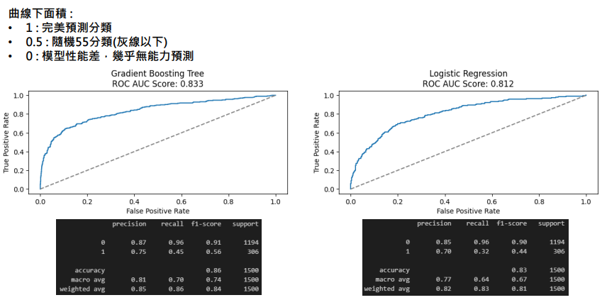

ALPHA Camp 金融專案_銀行顧客流失率預測
===

# 情境說明
**預測**什麼樣的銀行客戶**流失機率比較高**

# 結果
* [Report_PDF](https://github.com/DrDAN6770/MySQL_Python/blob/main/AC%E9%87%91%E8%9E%8D%E5%B0%88%E6%A1%88_%E9%8A%80%E8%A1%8C%E9%A1%A7%E5%AE%A2%E6%B5%81%E5%A4%B1%E7%8E%87/%E9%87%91%E8%9E%8D%E5%B0%88%E6%A1%88-%E9%8A%80%E8%A1%8C%E5%AE%A2%E6%88%B6%E6%B5%81%E5%A4%B1%E7%8E%87%E5%88%86%E6%9E%90.pdf)
* **資料集統計描述**

* **確認分析範圍**

* **逐步分析**

## 透過以下表格，一步步地進行以下的思考:
| 提出假設 | 與問題、假設相關的欄位、變數可能有哪些？ |
| :-- | :-- |
| e.g. 持有產品少的客戶，代表對銀行的產品還不信任或不了解，流失率較高 | 客戶資料、持有產品數、產品使用活躍時間 |

## 資料表介紹
| ColumnName | Description | Type |
| :-- | :-- | :-- | 
| RowNumber | 資料編號 | number |
| CustomerId | 客戶ID | number |
| Surname | 客戶姓氏 | string |
| CreditScore | 信用分數 | number |
| Geography | 居住國家 | string |
| Gender | 性別 | string |
| Age | 年齡 | number |
| Tenure | 來往期間(月) | number |
| Balance | 帳務餘額 | number |
| NumOfProducts | 是否持卡 | number |
| HasCrCard | 持有產品數 | number |
| IsActiveMember | 是否有效會員 | number |
| EstimatedSalary | 預估收入 | number |
| Exited | 是否流失 | number |

## 開始分析
| 提出假設 | 與問題、假設相關的欄位、變數可能有哪些？ | 驗證結果 |
| :-- | :-- | :-- |
| e.g. 持有產品少的客戶，代表對銀行的產品還不信任或不了解，流失率較高 | 客戶資料、持有產品數、產品使用活躍時間 | 是(否)，因為 （資料趨勢），因此假設為真(錯) |