# 1. 情境：將資料進行統整和有效資訊萃取
* **題目1-1：分析每個州的使用者、銷量等基本指標**
    

    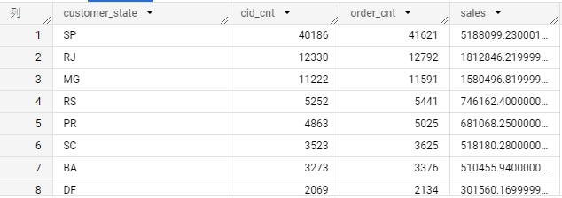
    

* **題目1-2: 將州的資料進行更上一層的統整**
    

    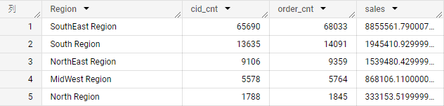
    

* **題目1-3: 萃取出地區層級的月份資料**
    

    
    

* **題目1-4: 將地區和月的資料再次進行更高層級的統整**
    

    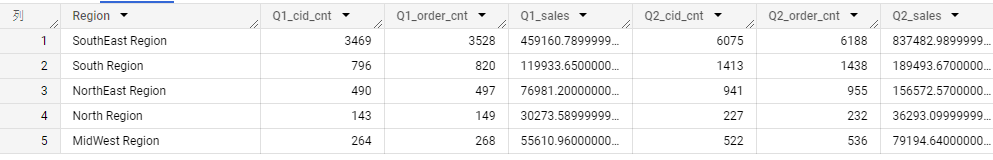
    

# 2. 情境：品類資料的提取、查詢和季節性的報表資料整理
* **題目2-1：查詢品類銷售相關指標**
    

    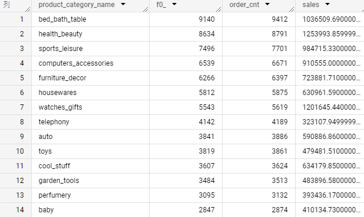
    

    * **題目2-1-1: 品類資料空值的處理**

        

        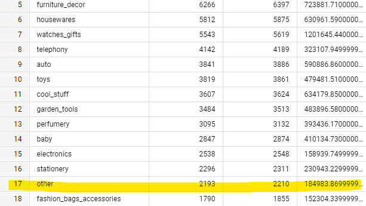
        

* **題目2-2: 將品類進行更大層級的分類**
    

    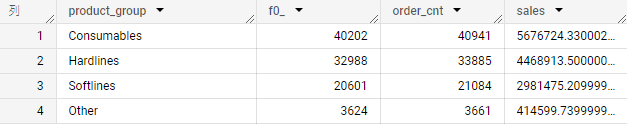
    

* **題目2-3: 提取區域品類的月份資料**
    

    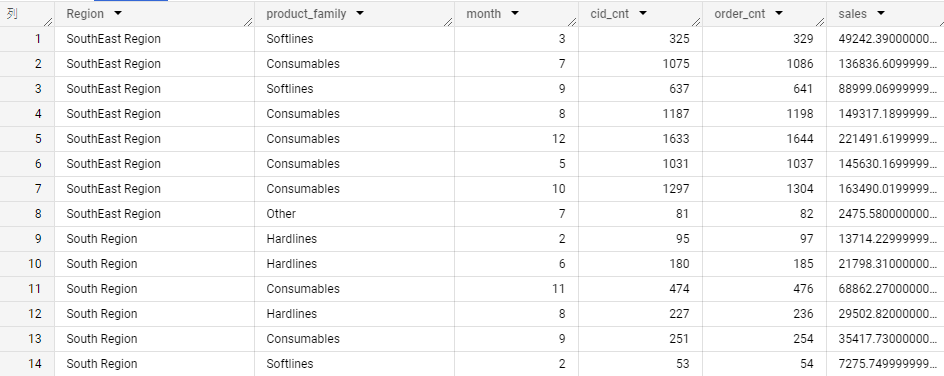
    

* **題目2-4: 將地區和月的資料進行更高層級的提取，並且放入年度的季節性**
    

    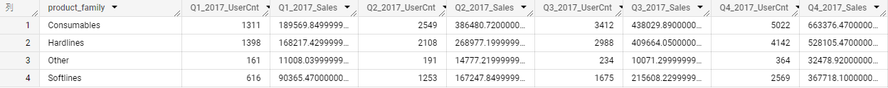
    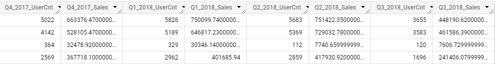
    

* **題目2-5: 將東南地區的品類線年/季度樞紐分析表狀的結果，加入YoY的變化**
    

    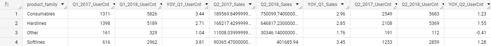
    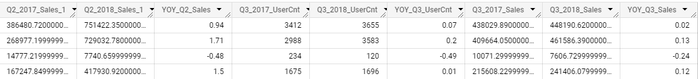
    

# 3. 情境：消費者的RFM分析
* **題目3-1-1: Frequency - 找出每個使用者的購買頻率**
* **題目3-1-2: Frequency - 查詢出不同訂單數的使用者人數分布**

* **題目3-2-1: Monetary - 找出每個消費者的花費總數**
* **題目3-3-1: Recency - 找出每個消費者最近的消費，並且計算和今日的天數差**
* **題目3-3-2: 查詢不同消費天數差的分布**
* **題目3-4-1: 針對R/F/M三個查詢指令和結果，將使用者分為高與低的兩群人**
* **題目3-4-2: 將3-4-1查詢結果結合再一起**
* **題目3-4-3: 完成分群！**